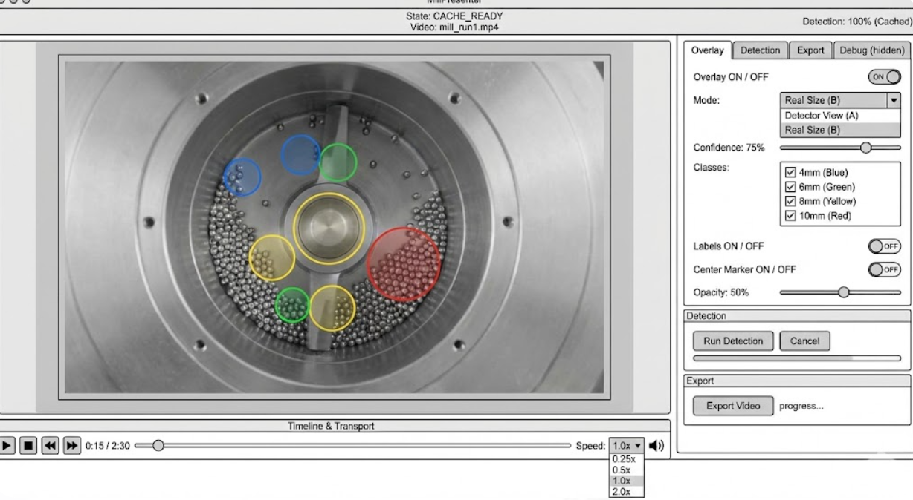

# MillPresenter UI (PyQt) — Player Spec & Feasibility

## 1) Is a pleasant/modern Player UI feasible in PyQt?
Yes. A clean, modern player UI is absolutely feasible in **PyQt6** as long as we follow these constraints:

- Video decoding stays in PyAV (or existing decoder thread)
- Playback UI renders QImage/QPixmap efficiently
- Overlay is drawn in a lightweight layer (QPainter)
- No CV runs during playback (“run once, play forever”)
- Qt layouts + stylesheets for a modern look

---

## 2) Core Principle
Two-phase system:

1. Offline Detection Phase  
2. Playback Phase  

> Run once, play forever.

---

## 3) Main Window Layout
- Top Bar: video name, cache status
- Center: Player canvas (video + overlay)
- Bottom Bar: transport controls
- Right Panel: Controls (tabbed)

---

## 4) UI States
- NO_CACHE
- DETECTING
- CACHE_READY
- CACHE_STALE
- ERROR

---

## 5) Player Canvas
- Single paintEvent recommended
- Draw frame first, overlay second
- Optional zoom and ROI debug

---

## 6) Transport Controls
- Play / Pause
- Seek slider (frame-accurate)
- Time display

---

## 7) Overlay Tab
- Overlay ON/OFF
- Draw Mode:
  - Mode A: Detector View (r_px)
  - Mode B: Real Size View (mm → px)
- Confidence slider
- Class filters (4/6/8/10)
- Style toggles (labels, centers, opacity)

---

## 8) Detection Tab
- Run Detection
- Cancel
- Progress bar
- Parameter groups (read-only during playback)

---

## 9) Export Tab
- Export MP4
- Inherits overlay settings
- Progress indicator

---

## 10) Debug Tab (Optional)
- Dump frame debug
- Show stats

---

## 11) Data Flow

Offline:
Video → CV Pipeline → JSONL Cache

Playback:
Frame N → Cache → OverlayRenderer → Display

---

## 12) Performance Rules
- No CV during playback
- Reuse QPen/QBrush
- Cache radii per class
- Debounce UI repaint

---

## 13) Acceptance Criteria
- Smooth playback
- Instant overlay response
- Export matches on-screen result

---
End of document.
